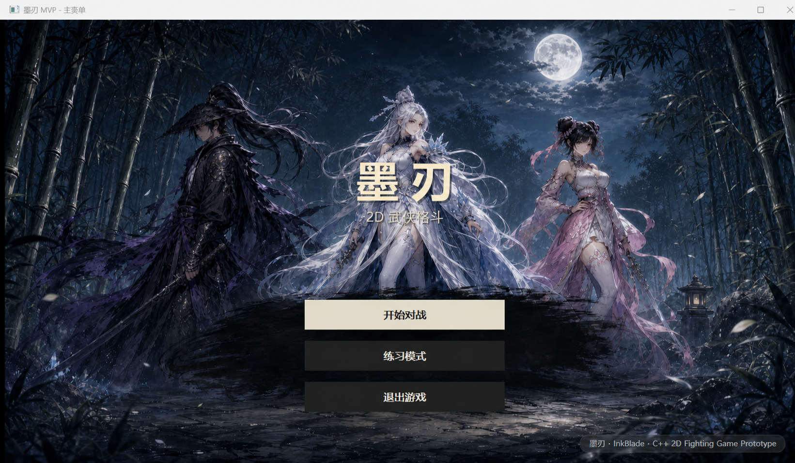
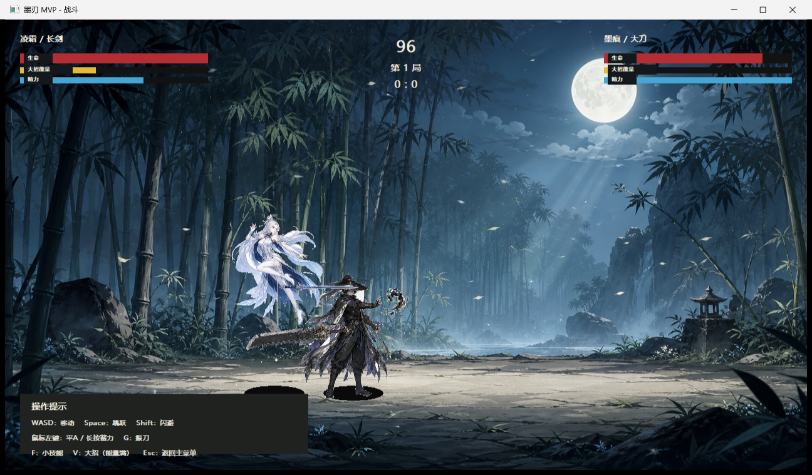
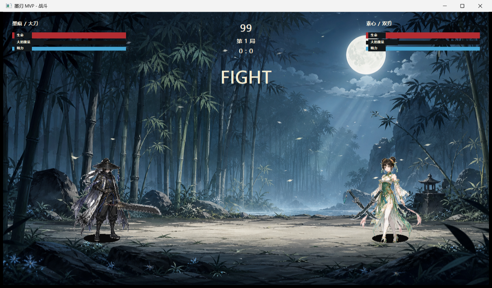
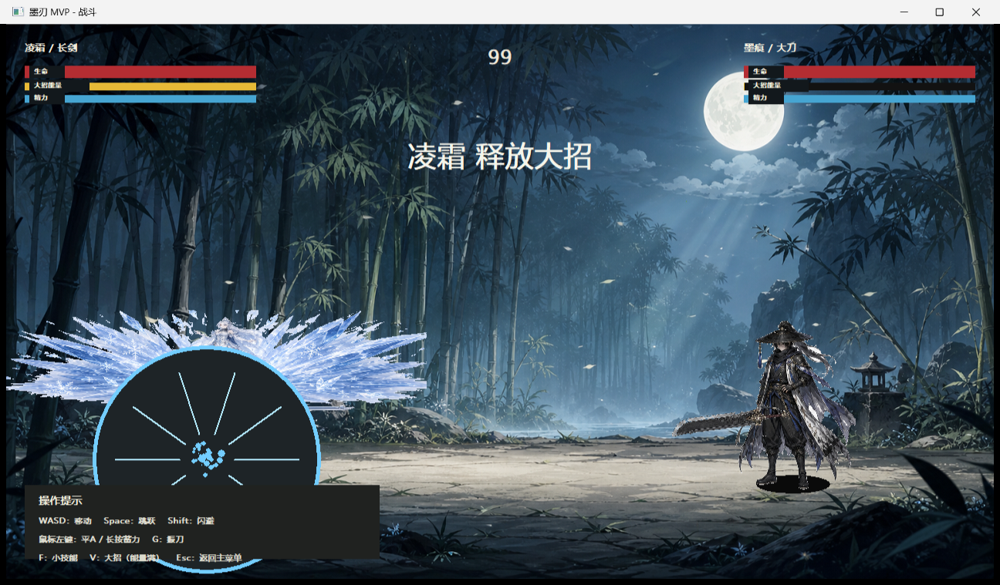

# 墨刃 · InkBlade

> 一款以**攻防博弈**为核心的 2D 水墨武侠格斗游戏原型。使用 C++17 / CMake / Win32 GDI 构建，聚焦输入响应、动作状态与战斗可读性。

[](https://isocpp.org/)
[](https://cmake.org/)
[](https://www.microsoft.com/windows)
[](https://github.com/wzzzzzzzzzx/InkBlade/releases/latest)

<p align="center">
  
</p>

<p align="center"><sub>© InkBlade · C++ 2D Fighting Game Prototype</sub></p>

## 快速体验

**Windows 用户可直接游玩：**前往 [Latest Release](https://github.com/wzzzzzzzzzx/InkBlade/releases/latest) 下载 `InkBlade-v1.0.0-win64.zip`，解压后运行 `InkBlade.exe`。

> 本项目为个人游戏开发原型，用于展示客户端工程、战斗系统实现和调试验证能力。

## 核心玩法

| 攻防博弈 | 角色与武器 | 对局流程 |
| --- | --- | --- |
| 普攻连段、蓄力、振刀、闪避和技能形成相互克制的决策循环。 | 3 名角色 × 3 类武器，共 9 种战斗组合。 | 角色选择 → 武器选择 → 练习/对战 → 三局两胜结算。 |

<p align="center">
  
  
</p>

<p align="center"><sub>左：长剑对局　·　右：双刃对局</sub></p>

<p align="center">
  
</p>

<p align="center"><sub>满能量后可释放角色大招，并提供练习模式快速验证战斗状态。</sub></p>

## 已实现内容

- **操作与状态**：移动、跳跃、普通攻击、蓄力攻击、振刀、闪避、小技能与大招。
- **战斗体验**：血量 / 体力 / 能量 HUD、受击与击杀反馈、回合引导、三局两胜流程。
- **配置驱动**：角色属性、武器连段、蓄力倍率、振刀窗口等由 JSON 配置管理。
- **资源接入**：角色动作、武器模型、技能特效、主菜单与竹林场景资源均已接入运行时。
- **验证方式**：自动化冒烟测试覆盖 9 组角色/武器组合，验证菜单进入、战斗切换和核心输入响应。

## 操作说明

| 按键 | 功能 |
| --- | --- |
| `WASD` | 移动 / 菜单选择 |
| `Space` | 跳跃 |
| 鼠标左键 | 普通攻击；长按后松开为蓄力攻击 |
| `G` | 振刀 |
| `Left Shift` | 闪避 |
| `F` / `V` | 小技能 / 满能量大招 |
| `Enter` / 鼠标点击 | 菜单确认 |
| `Esc` | 返回菜单 |

## 技术实现

- **语言与构建**：C++17、CMake、Ninja。
- **运行时**：Win32 / GDI，无外部运行时依赖；打包后可离线运行。
- **代码组织**：游戏主循环、输入处理、菜单状态、战斗状态、数据配置和资源加载分层组织。
- **可调试性**：练习模式提供能量、敌方行为和调试开关，便于复现并验证战斗逻辑。

## 本地构建

开发环境需具备 Visual Studio（含 C++ 工具链）、CMake 与 Ninja。仓库已提供脚本：

```powershell
./scripts/build.ps1
./scripts/package.ps1
```

打包结果位于 `dist/InkBlade/InkBlade.exe`。

---

欢迎下载体验，也欢迎在 [Issues](https://github.com/wzzzzzzzzzx/InkBlade/issues) 交流玩法与实现建议。
